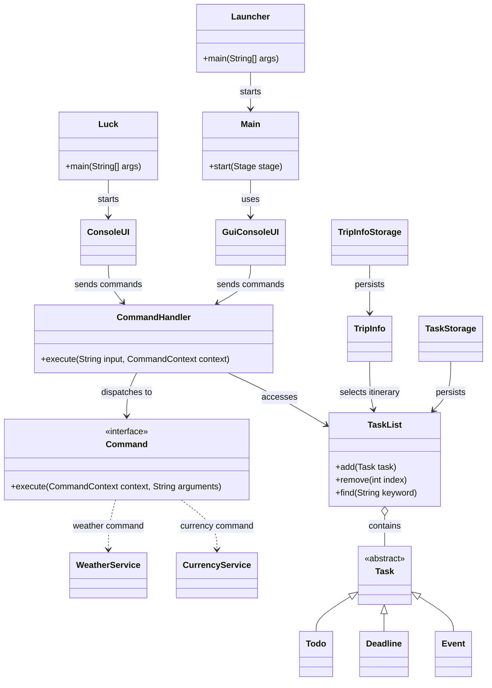
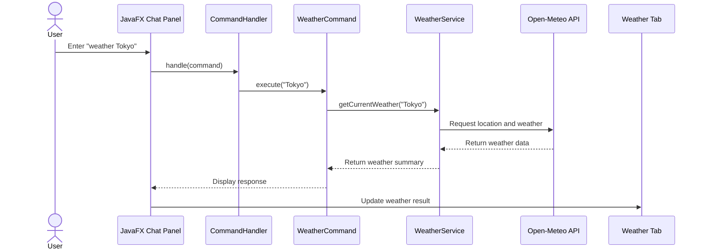
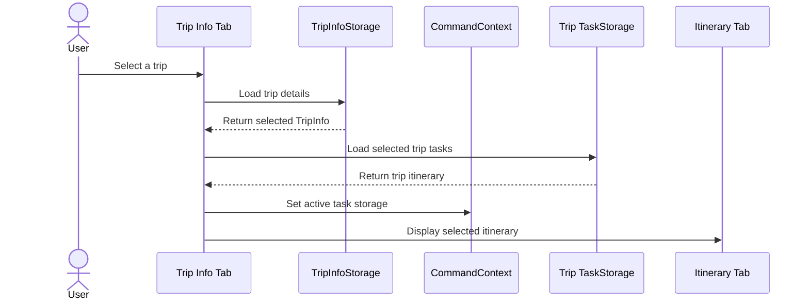

# Luck Developer Guide

## Acknowledgements

Luck is based on the Duke-style task-manager project used in the SE-EDU
teaching materials. The original task-manager structure and basic task
concepts were adapted and extended for this project; the travel-planner GUI,
multi-trip support, weather feature, currency feature, and their integration
are project-specific additions.

The following external resources and libraries are used:

- [SE-EDU Java conventions](https://se-education.org/guides/conventions/java/intermediate.html)
  informed the Java coding style.
- [JavaFX](https://openjfx.io/) provides the desktop GUI controls and layout.
- [Open-Meteo](https://open-meteo.com/en/docs) provides geocoding and weather
  forecast data through its public APIs.
- [Frankfurter](https://frankfurter.dev/) provides exchange-rate data through
  its public API.
- [Gradle](https://gradle.org/) manages compilation, testing, and packaging;
  the [Shadow plugin](https://gradleup.com/shadow/) creates the fat JAR.
- [JUnit 5](https://junit.org/junit5/) provides the automated test framework.

These resources are dependencies or references rather than copied project
code. API responses are parsed by Luck's own service classes, and all
application-specific commands, models, storage, and GUI behaviour were
implemented for this project.

## Setting up and getting started

Install JDK 25 and Gradle 9.2 or newer. From the project root, run:

```powershell
gradle build
gradle run
```

The console entry point is `luck.Luck`. The JavaFX desktop entry point is
`luck.gui.Launcher`.

## Design

### Architecture

```text
User
  |
  v
ConsoleUI or JavaFX GUI
  |
  v
CommandHandler ---> Command objects
  |                       |
  v                       v
TaskList and TripInfo   WeatherService / CurrencyService
  |                       |
  v                       v
TaskStorage          External APIs
TripInfoStorage
```

The following UML class diagram shows the main architectural relationships
between the application's layers:



The main components are:

- **UI**: `luck.ui` provides console interaction; `luck.gui` provides the
  JavaFX desktop application and chat output adapter.
- **Command**: `luck.command` parses command words and delegates work to
  individual command objects.
- **Model**: `luck.model` stores tasks, task lists, and trip information.
- **Storage**: `luck.storage` persists tasks and trip information locally.
- **Service**: `luck.service` communicates with external weather and currency
  APIs.
- **Exception**: `luck.exception` contains application-specific errors.

### UI component

`luck.gui.Main` builds the JavaFX window. Travel tabs are displayed on the left
and the chat panel remains on the right. The GUI includes Itinerary, Weather,
and Trip Info tabs.

`GuiConsoleUI` adapts command output for the chat panel instead of writing it
to the terminal. The GUI runs commands through the same `CommandHandler` used
by the console application.

### Command component

`CommandHandler` maps command words to objects implementing the `Command`
interface. `CommandContext` supplies the active task list, storage, and UI.

Each command has one main responsibility. To add a command:

1. Create a class in `luck.command` implementing `Command`.
2. Validate arguments and throw `LuckException` for invalid input.
3. Register the command in `CommandHandler`.
4. Add tests for valid and invalid input.
5. Document the command in `UserGuide.md`.

### Model component

The task model contains `Task`, `Todo`, `Deadline`, and `Event`. `TaskList`
provides operations such as add, remove, search, and retrieve.

`TripInfo` stores one trip's name, destination, dates, currency, and notes.
Each selected trip uses its own task storage file, allowing itineraries to be
switched without mixing tasks between trips.

### Storage component

`TaskStorage` serializes tasks to disk using `TaskParser`. Console tasks use
`data/luck.txt`.

`TripInfoStorage` saves multiple trips in
`data/trip-info.properties`. GUI itineraries are stored under `data/trips/`,
with one task file per trip.

## Sequence diagrams

### Weather command



### Trip selection and itinerary switching



## Implementation

### Task management

Task commands update the active `TaskList` and save through the active
`TaskStorage`. The GUI refreshes the Itinerary tab after task commands.

### Multi-trip itineraries

The Trip Info tab maintains a collection of `TripInfo` objects. Selecting a
trip loads its task file and updates the command context. New tasks therefore
belong to the currently selected trip.

### Weather and forecast

`WeatherCommand` delegates to `WeatherService`. The service first geocodes a
destination using Open-Meteo, then retrieves current weather or a five-day
forecast. Selecting a trip refreshes weather for its destination in a
background thread so the JavaFX UI remains responsive.

### Currency conversion

`CurrencyCommand` delegates to `CurrencyService`. It validates input such as
`currency 100 USD to JPY`, retrieves the latest exchange rate from Frankfurter,
and reports network or validation errors through `LuckException`.

### GUI resources

The JavaFX background image is stored at
`src/main/resources/travel.png` and loaded from the classpath so it is included
when the application is packaged.

## Testing

Tests are stored under `src/test/java/luck` using the same package structure as
the production code. The suite covers:

- Command validation and task operations
- Task parsing and date/time parsing
- Task and trip persistence
- Trip validation
- Invalid currency input

Run the tests with:

```powershell
gradle test
```

External API calls are not used in unit tests because network responses are
outside the test's control. Those integrations require manual testing.

## Build and packaging

The project targets Java 25. Create the fat JAR with:

```powershell
gradle shadowJar
```

The output is written to:

```text
release/luck.jar
```

Run it with:

```powershell
java -jar release/luck.jar
```

## Code quality and Git standards

Java code follows `.codex/skills/seedu-java-coding-standard/SKILL.md`.
Commits and branch names follow `.codex/skills/seedu-git-standard/SKILL.md`.
Changes should preserve readable names, focused methods, meaningful Javadoc,
and clear separation between UI, commands, model, storage, and services.

## Known limitations

- Weather and currency features require an internet connection.
- Automatic currency suggestions currently cover a limited set of common
  countries.
- JavaFX visual behavior requires manual testing on a desktop environment.
- Gradle may be unable to delete `build` when Java, VS Code, or OneDrive holds
  compiled files open.
